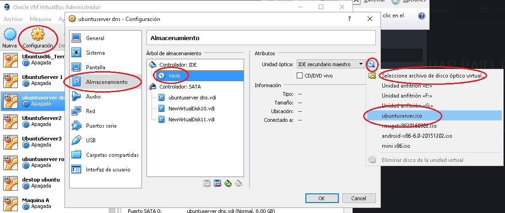
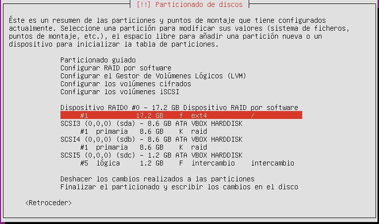
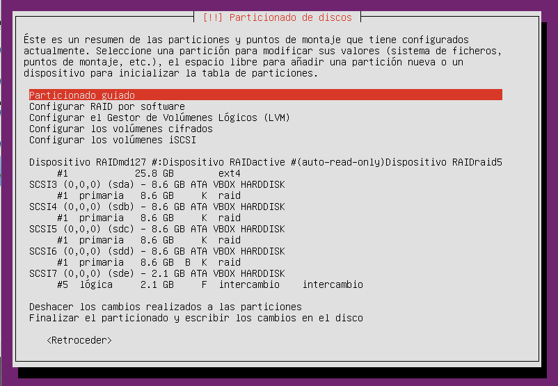
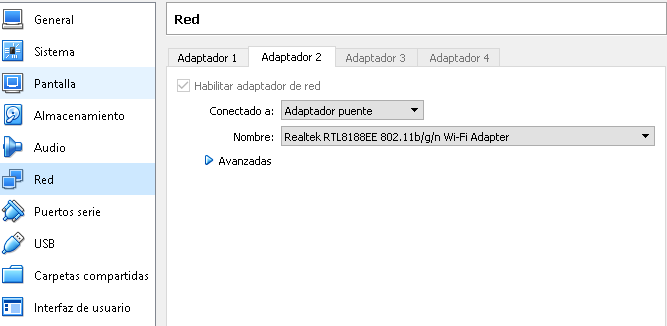
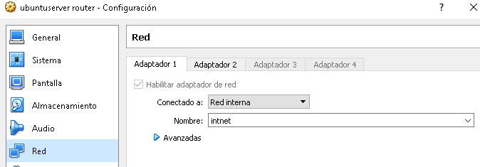
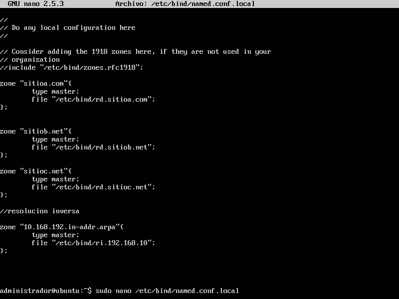
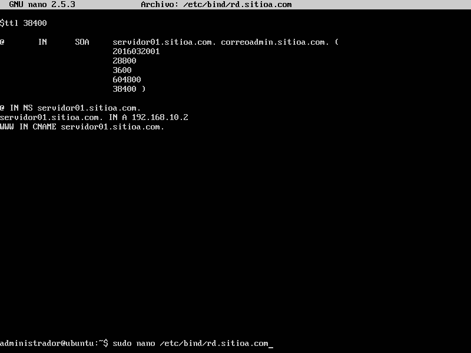
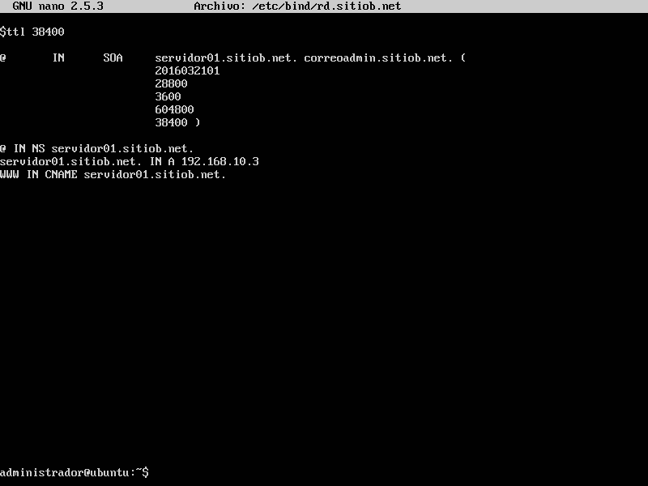
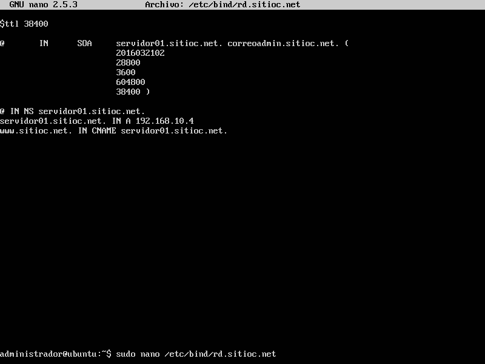

# 
CONFIGURAR RAID, ROUTER Y DNS EN UBUNTU SERVER

### 1. CONFIGURAR RAID
1. Usar una imagen iso de UBUNTU para insertarla en la maquina virtual.

    

2. Añadir los discos duros con los que se van a hacer el RAID

    

4. Iniciar la Maquina virtual y seguir los pasos hasta llegar a particionado de disco. Escoge la opcion manual y usar la configuracion que se muestra abajo. En mi caso el servidor dns le puse un raid0 con 2 discos duros + area de intercambio y a los servidores web raid5 con 4 discos duros + area de intercambio

    * Configuracion RAID 0
        

    * Configuracion RAID 5
        

5. Continuar la instalación

### 2. Configurar router en ubuntu
* Antes de nada asegurate de la configuracion de las 2 tarjetas de red en vbox.

      

    
1. En ubuntu configurar las interfaces en el siguiente fichero  
`sudo nano /etc/network/interfaces`  
`ifconfig -a` Muestra las tarjetas de red de tu ordenador
    ~~~
    # El signo '#' es para comentar una linea
    # configuracion de loopback network interfaces
    # tambien llamado localhost o bucle interno
    auto lo
    iface lo inet looback

    # configuracion de la primera interfaz de red interna
    auto enp0s3
    iface enp0s3 inet static
          address 192.168.10.254
          netmask 255.255.255.0
          network 192.168.10.0
          broadcast 192.168.10.255

    # configuracion de la segunda interfaz red externa
    auto enp0s8
    iface enp0s8 inet dhcp
    ~~~
    

2. Configura el reenvio de paquetes
`sudo nano /etc/sysctl.conf`  
Buscar la linea  
`# net.ipv4.ip_forward=1`  
Quitale la almoadilla devería de quedar asín  
`net.ipv4.ip_forward=1`

3. Por ultimo pasaremos los paquetes que vengan de la red interna a la externa
    * Vamos a crear un peque?os script para que lo haga

    * Nos situamos en nuestra carpeta de usuario  
    `cd $HOME`

    * Creamos un fichero .sh  
    `sudo nano up-router.sh`

    * Escribimos la siguiente linea  
    `iptables -t nat -A POSTROUTING -s 192.168.10.0/24 -o enp0s8 -j MASQUERADE`  

    * Lo guardamos, Reiniciamos las tarjetas de red  
    `sudo /etc/init.d/network restart`

    * Ahora iniciamos el script  
    `sudo sh $HOME/up-router.sh`

    * Para que el script se execute cadavez que se reinicie el ordenador hacemos lo siguiente
      * Cambiamos los permisos del fichero  
      `sudo chmod 755 $HOME/up-router`

      * Movemos el fichero a init.d
      `sudo mv $HOME/up-router.sh /etc/init.d`

4. Ya estaria todo configurado si llegado a este punto no funciona prueba a reiniciar la maquina virtual

### 3. Configuracion servidor de DNS
* Asegurate de estar conectado com red interna
1. Configuracion de la tarjeta de red  
`sudo nano /etc/network/interfaces`  
`ifconfig -a` Muestra las tarjetas de red de tu ordenador
    ~~~
    # El signo '#' es para comentar una linea
    # configuracion de loopback network interfaces
    # tambien llamado localhost o bucle interno
    auto lo
    iface lo inet looback

    # configuracion de la primera interfaz de red interna
    auto enp0s3
    iface enp0s3 inet static
          address 192.168.10.200
          netmask 255.255.255.0
          gateway 192.168.10.254
          dns-nameservers 192.168.10.254 8.8.8.8
    ~~~

2. Instalar bind9 es el servidor de dns para ubuntu SERVER  
`sudo apt-get install bind9`

3. Ahora vamos a configurar los archivos de configuración de bind9
    * El primero el el named.conf.local  
    `sudo nano /etc/bind/named.conf.local`  

      
    ~~~
    zone "sitioa.com"{
          type master;
          file "/etc/bind/rd.sitioa.com";
    };

    zone "sitiob.net"{
          type master;
          file "/etc/bind/rd.sitiob.net";
    };

    zone "sitioa.com"{
          type master;
          file "/etc/bind/rd.sitioc.net";
    };

    //resolucion inversa

    zone "10.168.192.in-addr.arpa"{
          type master;
          file "/etc/bind/ri.192.168.10";
    }

    ~~~
    * Los segundos son los archivos de dns que hemos puesto en el anterior
        * Archivo /etc/bind/rd.sitioa.com con el siguiente comando  
        `sudo nano /etc/bind/rd.sitioa.com`

            
            ~~~
            $TTL 38400

            @ IN SOA servidor01.sitioa.com. correoadmin.sitioa.com. (
            	2014092900   //num serie
            	28800        //refresco
            	3600         //reintentos
            	604800       //caducidad
              38400)       // tiempo en caché

            @ IN NS servidor01.sitioa.com.
            servidor01.sitioa.com. IN A 192.168.10.2
            WWW IN CNAME servidor01.sitioa.com.

            ~~~

        * Archivo /etc/bind/rd.sitiob.net con el siguiente comando  
        `sudo nano /etc/bind/rd.sitiob.net`

            
            ~~~
            $TTL 38400

            @ IN SOA servidor01.sitiob.net. correoadmin.sitiob.net. (
            	2016032101   //num serie
            	28800        //refresco
            	3600         //reintentos
            	604800       //caducidad
              38400)       // tiempo en caché

            @ IN NS servidor01.sitiob.net.
            servidor01.sitiob.net. IN A 192.168.10.3
            WWW IN CNAME servidor01.sitiob.net.

            ~~~

        * Archivo /etc/bind/rd.sitioc.net con el siguiente comando  
        `sudo nano /etc/bind/rd.sitioc.net`

            
            ~~~
            $TTL 38400

            @ IN SOA servidor01.sitioc.net. correoadmin.sitioc.net. (
            	2016032102   //num serie
            	28800        //refresco
            	3600         //reintentos
            	604800       //caducidad
              38400)       // tiempo en caché

            @ IN NS servidor01.sitioc.net.
            servidor01.sitioc.net. IN A 192.168.10.4
            WWW IN CNAME servidor01.sitioc.net.

            ~~~
        * Archivo resolucion inversa /etc/bind/ri.192.168.10 con el siguiento comando  
        `sudo nano /etc/bind/ri.192.168.10`

            

            ~~~
            $TTL 38400

            @ IN SOA servidor01.sitioa.net. correoadmin.sitioa.net. (
              2017032100   //num serie
              28800        //refresco
              3600         //reintentos
              604800       //caducidad
              38400)       // tiempo en caché

            @ IN NS servidor01.
            2 IN PTR servidor01.sitioa.com.
            3 IN PTR servidor01.sitiob.net.
            4 IN PTR servidor01.sitioc.net.
            ~~~  

    * Despues tienes que configurar en caso de que el servidor no conozca los nombres de dominio le pregunte a otro servidor.  
    `sudo nano /etc/bind/named.conf.options`

      

      ~~~
      // quitar la doble '/' a todo el forwarders
      forwarders {
              8.8.8.8;
              8.8.4.4;
      };

      ~~~
4. Una vez listo reiniciaremos bind9  
`sudo /etc/init.d/bind9 restart`  
  Para comprobar si tiene fallos podemos usar estos comandos  

    `named-checkconf`  

    `named-checkzone sitioa /etc/bind/rd.sitioa.com`

### 4. Servidors web y ftp

* Asegurate de estar conectado con red interna
1. Configuracion de la tarjeta de red  
`sudo nano /etc/network/interfaces`  
`ifconfig -a` Muestra las tarjetas de red de tu ordenador
    ~~~
    # El signo '#' es para comentar una linea
    # configuracion de loopback network interfaces
    # tambien llamado localhost o bucle interno
    auto lo
    iface lo inet looback

    # configuracion de la primera interfaz de red interna
    auto enp0s3
    iface enp0s3 inet static
          address 192.168.10.x
          netmask 255.255.255.0
          gateway 192.168.10.254
          dns-nameservers 192.168.10.254 8.8.8.8
    ~~~
    **En la posicion x pon '2' para sitioa.com o '3' para sitiob.net o '4' para sitioc.net y reiniciamos las tarjetas de red**  
    `sudo /etc/init.d/network restart`

2. Instalamos el servidor web con el siguiente comandos  
`sudo apt-get install apache2`

3. Instalamos el servidor ftp con el siguiente comando  
`sudo apt-get install vsftpd`
